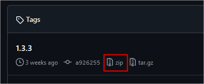
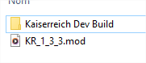
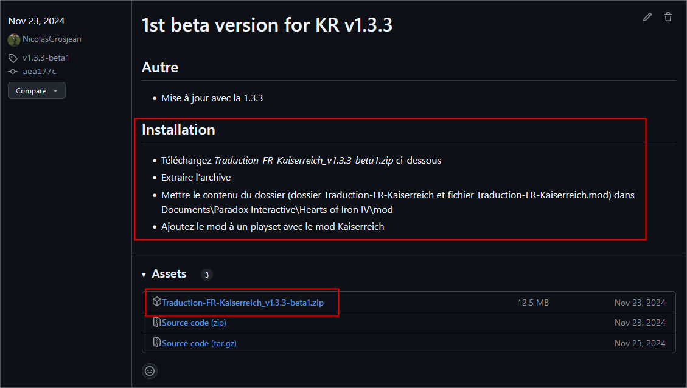

# Installation manuelle d'une ancienne version

## Version de HoI4

Il faut d'abord s'assurer que la version de Kaiserreich (KR par la suite) auquel vous voulez jouer correspond à la version de HoI4 que vous avez installé.

Si ce n'est pas le cas, veuillez suivre [ce tutoriel en anglais](https://forum.paradoxplaza.com/forum/threads/how-to-roll-back-your-game-version.1121392/) pour mettre la bonne version de HoI4.

## Installation de KR

### Téléchargement

Allez sur le [GitHub d'archive de KR listant toutes les versions disponibles](https://github.com/Kaiserreich/Kaiserreich-4-Archive/tags).

Téléchargez la version souhaitée. Par exemple l'image suivante vous montre où cliquer pour récupérer le `.zip` de la version `1.3.3`.

### Installation

- Supprimer toute installation manuelle précédente
- Extraire l'archive précédemment téléchargée dans le dossier Documents\Paradox Interactive\Hearts of Iron IV\mod
- Renommer le dossier extrait en `Kaiserreich Dev Build`
- Aller à l'intérieur du dossier, copier le fichier `descriptor.mod` et le coller à côté du dossier
- Renommer le fichier comme bon vous semble, par exemple `KR_1_3_3.mod` comme dans l'image suivante

## Installation de la traduction

Allez sur la [page des releases de la traduction](https://github.com/TheAzmyr/Traduction-FR-Kaiserreich/releases),
prendre la dernière version de traduction correspondant à la version de Kaiserreich.

Suivre les instructions de la section `Installation` (cf image suivante pour la `1.3.3`)

## Configuration du launcher

Lancez HoI4, créez un preset et ajoutez les mods:

- `Kaiserreich Dev Build`
- `Kaiserreich raduction Francophone`
- D'autres mods compatibles

## Resources

- Instructions pour changer la version de HoI4 : https://forum.paradoxplaza.com/forum/threads/how-to-roll-back-your-game-version.1121392/
- Documentation pour installer manuellement KR : https://github.com/Kaiserreich/Kaiserreich-4-Archive/blob/master/Readme.txt